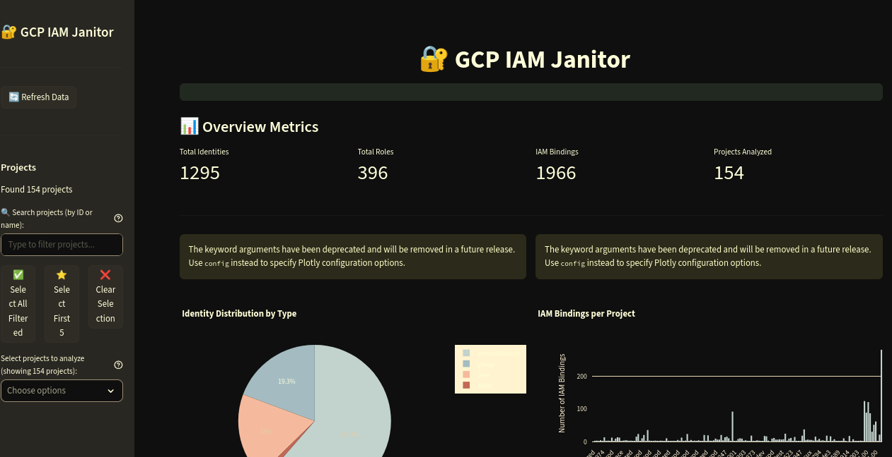
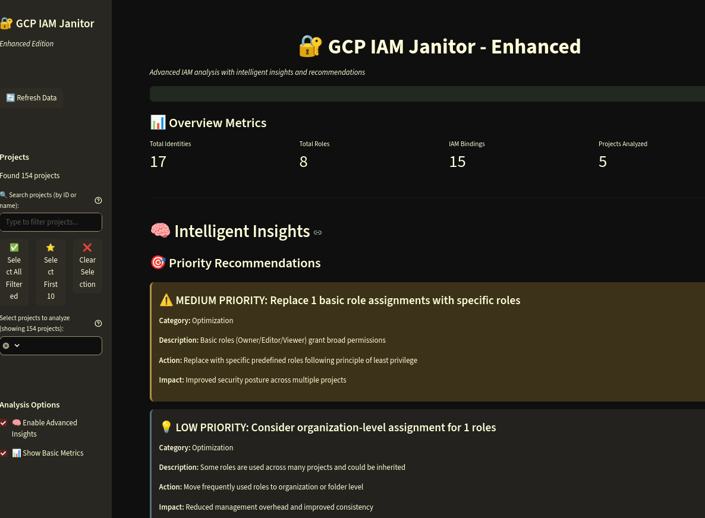
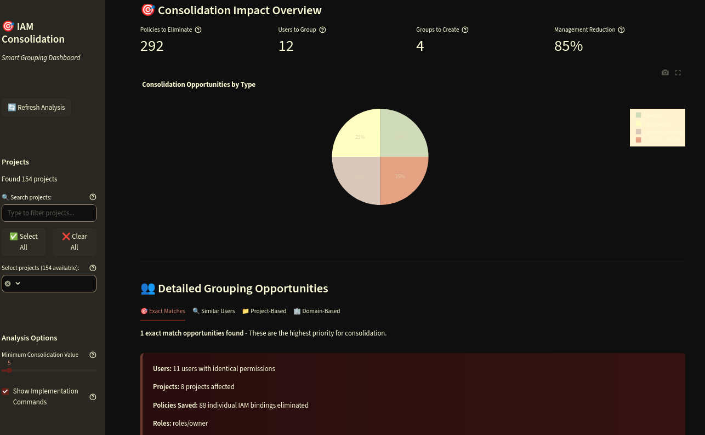

# 🔐 GCP IAM Janitor

A comprehensive web application for inventorying, analyzing, and managing Google Cloud Platform IAM across projects and organizations. Built with Streamlit, this tool provides visual insights, security analysis, and powerful IAM policy consolidation capabilities through intelligent user grouping.

🎯 **NEW**: **Consolidation Dashboard** - Reduce IAM policy complexity through intelligent grouping recommendations and automated implementation guidance.

## ✨ Features

### 🌐 CloudFast & Cloud Foundation Fabric Optimized
- **🏗️ CloudFast Architecture Support**: Designed specifically for Google Cloud Foundation Fabric patterns
- **📁 Squad-Based Folder Organization**: Handles environments split by squad/team rather than business unit
- **🔄 Flexible Hierarchy Analysis**: Adapts to custom organizational structures and naming conventions
- **⚡ Fabric-Aware IAM Patterns**: Recognizes and optimizes CloudFast IAM inheritance patterns
- **🎯 Environment-Specific Insights**: Tailored analysis for dev/staging/prod environments per squad

### 🎯 Consolidation Dashboard (NEW)
- **📉 IAM Policy Reduction**: Intelligent analysis to reduce policy count through smart user grouping
- **🔍 Grouping Opportunities**: Identifies users with similar permissions for group consolidation
- **🌐 Interactive Network Graphs**: Visual representation of user-group relationships
- **📋 Implementation Roadmaps**: Phased approach with comprehensive gcloud commands
- **📈 Impact Analysis**: Quantifies policies saved and consolidation value
- **🏆 Compliance Reporting**: Integrated compliance analysis with 8 major frameworks
- **🤖 Automated Group Creation**: Complete gcloud automation for group management
- **📥 Export Capabilities**: Download scripts, reports, and compliance documentation
- **🎨 Advanced Visualizations**: Heatmaps, matrices, and priority-based recommendations

### Core Features (All Versions)
- **🔍 Complete IAM Inventory**: Analyze identities, roles, and permissions across all your GCP resources
- **📉 Interactive Visualizations**: Charts, graphs, and network diagrams showing IAM relationships  
- **🚪 Security Analysis**: Identify overprivileged users, external accounts, and security risks
- **📋 Comprehensive Reporting**: Export data and generate compliance reports
- **🏆 Compliance Analysis**: Built-in templates for HITRUST, HIPAA, SOC2, SOC3, ISO27001, NIST, PCI DSS, FedRAMP
- **🔄 Multi-Project Analysis**: Support for analyzing multiple GCP projects with enhanced selection tools
- **⚡ Cached Performance**: Intelligent caching for faster data retrieval
- **🎨 Modern UI**: Clean, responsive interface built with Streamlit

### Enhanced Version Features
- **🧠 AI-Powered Insights**: Intelligent analysis with actionable recommendations
- **🎯 Priority-Based Recommendations**: Color-coded recommendations by urgency (High/Medium/Low)
- **👥 Smart Grouping Suggestions**: Identify opportunities to create groups for better management
- **🔄 Duplicate Permission Detection**: Find redundant role assignments and overlapping permissions
- **🏢 Organization-Level Optimization**: Suggestions for roles that should be assigned at org level
- **📈 Advanced Security Metrics**: Risk scoring for identities and comprehensive threat analysis
- **🤖 Service Account Risk Analysis**: Detection of unused or potentially compromised service accounts
- **🔧 Role Optimization**: Recommendations to replace basic roles with more specific permissions
- **📊 Enhanced Visualizations**: More detailed charts and analysis views
- **💡 Actionable Insights**: Specific steps to improve your IAM security posture

## 🚀 Quick Start

### Prerequisites

- Python 3.13.7 or higher
- Google Cloud SDK (`gcloud`) installed and configured
- Appropriate GCP IAM permissions to read IAM policies
- `uv` package manager (recommended) or `pip`

### Installation

1. **Clone the repository:**
   ```bash
   git clone https://github.com/erasmus74/GCP-IAM-Janitor.git
   cd GCP-IAM-Janitor
   ```

2. **Install dependencies using uv:**
   ```bash
   uv sync
   ```

3. **Authenticate with Google Cloud:**
   ```bash
   gcloud auth application-default login
   ```

4. **Run the application:**
   
   **Simple Version (Basic IAM Analysis):**
   ```bash
   ./run.sh
   ```
   
   **Enhanced Version (With AI Insights & Advanced Analytics):**
   ```bash
   ./run.sh enhanced
   ```
   
   **🎯 Consolidation Dashboard (IAM Policy Reduction Focus):**
   ```bash
   ./run.sh consolidation
   ```
   
   **🚀 Advanced Dashboard (NEW - ALL Advanced Features):**
   ```bash
   ./run.sh advanced
   ```
   
   Or manually:
   ```bash
   source .venv/bin/activate
   # For simple version
   streamlit run app_simple.py
   # For enhanced version
   streamlit run app_enhanced.py
   # For consolidation dashboard
   streamlit run app_consolidation.py
   ```

5. **Open your browser** to `http://localhost:8501`

## 🐳 Docker Deployment

### Quick Docker Start

For a quick containerized deployment using Docker Compose:

```bash
# Start the consolidation dashboard
./scripts/deploy.sh run consolidation

# Or start other versions
./scripts/deploy.sh run simple
./scripts/deploy.sh run enhanced
./scripts/deploy.sh run advanced
```

### Docker Commands

```bash
# View logs
./scripts/deploy.sh logs

# Stop containers
./scripts/deploy.sh stop

# View status
./scripts/deploy.sh status

# Clean up
./scripts/deploy.sh clean
```

### Registry Deployment (Recommended)

Use pre-built images from GitHub Container Registry for faster deployment:

```bash
# Run from registry (no local build required)
./scripts/deploy-registry.sh run consolidation

# Or other versions
./scripts/deploy-registry.sh run simple
./scripts/deploy-registry.sh run enhanced
./scripts/deploy-registry.sh run advanced

# Pull all images
./scripts/deploy-registry.sh pull all

# Direct container run
./scripts/deploy-registry.sh direct consolidation
```

**Registry Images:**
- `ghcr.io/erasmus74/gcp-iam-janitor:main-simple`
- `ghcr.io/erasmus74/gcp-iam-janitor:main-enhanced`
- `ghcr.io/erasmus74/gcp-iam-janitor:main-consolidation`
- `ghcr.io/erasmus74/gcp-iam-janitor:main-advanced`

### Manual Docker Build

```bash
# Build the image
docker compose build

# Run with specific version
docker compose up -d
# Access at http://localhost:8501
```

### Docker Features

- **🏗️ Multi-stage builds** with optimized uv dependency management
- **🔒 Security-focused** with non-root user execution
- **⚡ Fast builds** using Docker layer caching and uv
- **🎯 Version support** for all dashboard variants (simple, enhanced, consolidation, advanced)
- **📝 Health checks** for container monitoring
- **🌐 Production ready** with proper error handling and logging

## 📸 Screenshots

### 📊 Simple Dashboard
*Basic IAM analysis with essential metrics and visualizations*



### 🧠 Enhanced Dashboard
*AI-powered insights with advanced analytics and recommendations*



### 🎯 Consolidation Dashboard  
*Specialized IAM policy reduction through intelligent user grouping*



## 🔑 Authentication Setup

### Application Default Credentials (Recommended)

The easiest way to get started is with Application Default Credentials:

```bash
gcloud auth application-default login
```

### Required Permissions

Your authenticated account needs the following IAM permissions:

**For Project Analysis:**
- `resourcemanager.projects.get`
- `resourcemanager.projects.list` 
- `resourcemanager.projects.getIamPolicy`

**For Organization Analysis:**
- `resourcemanager.organizations.get`
- `resourcemanager.organizations.list`
- `resourcemanager.organizations.getIamPolicy`
- `resourcemanager.folders.list`
- `resourcemanager.folders.getIamPolicy`

**For Role Analysis:**
- `iam.roles.list`
- `iam.roles.get`

**Recommended Roles:**
- `Security Reviewer` (roles/iam.securityReviewer)
- `Organization Viewer` (roles/resourcemanager.organizationViewer)
- `Project Viewer` (roles/viewer) on target projects

**For Advanced Features (Enhanced Identity Analysis & Audit Trail Integration):**
- `Cloud Identity Groups Reader` (for group membership resolution)
- `Logging Viewer` (roles/logging.viewer) for audit log analysis
- `Cloud Identity API access` (requires domain admin consent for Google Workspace)

### 🔧 Configuration for Advanced Features

#### Cloud Identity API Setup (Optional)
For enhanced identity analysis with group membership resolution:

1. **Enable Cloud Identity API:**
   ```bash
   gcloud services enable cloudidentity.googleapis.com
   ```

2. **Set up domain-wide delegation** (for Google Workspace customers):
   - Follow Google's [domain-wide delegation guide](https://developers.google.com/identity/protocols/oauth2/service-account#delegatingauthority)
   - Grant necessary scopes for Cloud Identity API

#### Audit Logging Configuration
For comprehensive audit trail analysis:

1. **Ensure audit logs are enabled:**
   ```bash
   # Check current audit configuration
   gcloud logging sinks list
   
   # Verify admin activity logs are enabled (should be by default)
   gcloud projects get-iam-policy PROJECT_ID --format="json" | grep auditConfigs
   ```

2. **Recommended log retention:**
   - Set appropriate log retention periods for compliance requirements
   - Consider using log exports to BigQuery for long-term analysis

## 📖 Usage Guide

### 🌐 CloudFast & Cloud Foundation Fabric Organizations

This tool is optimized for organizations following Google's Cloud Foundation Fabric patterns, including:

- **Squad-Based Structure**: Environments organized by squad/team rather than traditional business units
- **CloudFast Hierarchies**: Automatic recognition of CloudFast folder and project naming conventions  
- **Environment Patterns**: Intelligent handling of dev/staging/prod environments per squad
- **Fabric IAM Inheritance**: Optimized analysis of IAM policies following Cloud Foundation Fabric best practices

The tool automatically adapts to your organizational structure - simply connect to your GCP organization and it will analyze your specific hierarchy pattern.

### Navigation

**Simple & Enhanced Versions:**
1. **Overview** - High-level statistics and key metrics
2. **Identities** - User, service account, and group analysis
3. **Roles** - Role inventory and usage analysis
4. **Permissions** - Permission analysis and risk assessment
5. **Settings** - Authentication and application settings

**🎯 Consolidation Dashboard:**
Specialized single-page dashboard focused on IAM policy reduction:
- **Consolidation Overview** - Impact metrics and savings potential
- **Grouping Opportunities** - Tabbed analysis of different grouping strategies
- **Network Visualization** - Interactive user-group relationship graphs
- **Impact Matrix** - Consolidation metrics heatmap
- **Implementation Roadmap** - Step-by-step deployment guidance with commands

### Filtering Data

Use the sidebar filters to focus your analysis:

- **Resource Scope**: Choose between all resources, organization-level, or project-level analysis
- **Organizations**: Select specific organizations to analyze
- **Projects**: Choose which projects to include with enhanced selection tools:
  - 🔍 **Search Filter**: Type to search projects by ID or name
  - ✅ **Select All Filtered**: Select all projects matching your search
  - ⭐ **Select First N**: Quick selection of top projects for performance
  - ❌ **Clear Selection**: Remove all selected projects
- **Identity Types**: Filter by user, service account, group, or domain
- **Role Types**: Filter by basic, predefined, or custom roles

### Key Metrics

The Overview page displays essential metrics:

- **Total Identities**: Unique users, service accounts, and groups
- **Total Roles**: Unique roles assigned across all resources  
- **IAM Bindings**: Total number of role-to-identity bindings
- **Resources Analyzed**: Number of projects and organizations examined

### Security Insights

The application automatically identifies potential security issues:

- **Overprivileged Identities**: Users/accounts with excessive role assignments
- **External Users**: Gmail accounts with access to your resources
- **Service Account Usage**: Analysis of service account distribution
- **Basic Role Usage**: Detection of overly broad basic roles (Owner/Editor/Viewer)

## 🧠 Enhanced Version Features

The Enhanced Version (`app_enhanced.py`) includes advanced AI-powered analytics:

### Intelligent Insights Dashboard

1. **Priority Recommendations**
   - High-priority security issues (red alerts)
   - Medium-priority optimization opportunities (yellow warnings)
   - Low-priority improvements (blue suggestions)

2. **Security Analysis**
   - Risk scoring for identities
   - Detection of external user access
   - Service account security assessment
   - Identification of high-privilege assignments

3. **Smart Grouping Opportunities**
   - Role-based grouping suggestions
   - Domain-based user grouping
   - Automated group name recommendations

4. **Role Optimization**
   - Basic role replacement suggestions
   - Cross-project role identification
   - Custom role utilization analysis
   - Organization-level assignment candidates

5. **Duplicate Permission Detection**
   - Redundant role assignments
   - Overlapping permission analysis
   - Cleanup recommendations

6. **Identity Analysis**
   - Multi-project user patterns
   - Over-privileged account detection
   - External access monitoring

### Enhanced Analytics Features

- **Risk Scoring**: Numerical risk assessment for identities
- **Pattern Recognition**: Identifies common access patterns
- **Automated Suggestions**: Specific, actionable recommendations
- **Impact Assessment**: Explains the potential impact of each issue
- **Priority Ordering**: Recommendations sorted by business impact

## 🚀 Advanced Dashboard Features (NEW!)

The Advanced Dashboard (`app_advanced.py`) is the most comprehensive version, featuring ALL advanced capabilities:

### 🔍 Enhanced Identity Analysis
- **Group Membership Resolution**: Uses Cloud Identity API to resolve user group memberships
- **Activity Pattern Analysis**: Tracks user behavior through audit logs
- **Risk Assessment**: Comprehensive risk scoring for identities
- **Batch Analysis**: Analyze multiple identities simultaneously

### 👑 Advanced Role Management
- **Role Comparison Tool**: Compare permissions between roles with similarity scoring
- **Custom Role Builder**: Interactive tool to create custom roles with validation
- **Role Templates**: Pre-built templates for common use cases (Developer, DevOps, Security, etc.)
- **Usage Analysis**: Analyze how roles are used across your organization

### 🔐 Permission Deep Dive
- **Risk Scoring**: Advanced permission risk assessment with 0-100 scoring
- **Security Analysis**: Identify high-risk permissions and security implications
- **Compliance Mapping**: Map permissions to compliance frameworks (SOX, PCI-DSS, HIPAA, GDPR)
- **Mitigation Strategies**: Specific recommendations for reducing permission risks

### 📋 Audit Trail Integration
- **Historical IAM Changes**: Track all IAM policy changes over time
- **Security Incident Detection**: Automated detection of suspicious patterns
- **User Access Patterns**: Analyze user behavior and detect anomalies
- **Compliance Reports**: Generate detailed compliance audit reports

## 🏆 Compliance Reporting Features (NEW!)

Comprehensive compliance analysis with pre-built templates for major frameworks:

### Supported Frameworks
- **🏥 HITRUST CSF** - Healthcare industry security framework with 6 key IAM controls
- **🧠 HIPAA Security Rule** - Healthcare privacy requirements with 7 IAM-specific controls
- **🔒 SOC 2 Type II** - Trust services criteria for security and availability (5 controls)
- **📄 SOC 3** - Simplified SOC 2 reporting (2 main control areas)
- **🌍 ISO 27001** - International information security standard (3 key controls)
- **🏢 NIST Cybersecurity Framework** - US federal cybersecurity guidelines (3 controls)
- **💳 PCI DSS** - Payment card industry security standards (3 controls)
- **🏛️ FedRAMP** - Federal cloud security requirements (3 controls)

### Compliance Analysis Engine
1. **Control Evaluation**
   - Maps IAM configurations to specific compliance requirements
   - Automated assessment of 30+ compliance controls
   - Risk-based severity classification (Critical/High/Medium/Low)

2. **Cross-Framework Analysis**
   - Identifies issues affecting multiple compliance standards
   - Consolidated recommendations across frameworks
   - Priority-based remediation guidance

3. **Compliance Scoring**
   - Overall compliance percentage across all frameworks
   - Individual framework scoring and status
   - Detailed findings with actionable recommendations

### Export & Reporting
- **📥 JSON Reports** - Complete machine-readable compliance data
- **📈 CSV Summaries** - Framework scores for spreadsheet analysis
- **📋 Markdown Reports** - Human-readable compliance documentation
- **🔍 Audit Trail** - Detailed findings with control mappings

### Integration
- **Dashboard Tab** - Dedicated compliance analysis interface
- **Framework Selection** - Choose specific standards to analyze
- **Real-time Analysis** - Immediate compliance assessment
- **Export Downloads** - One-click report generation

## 🎯 Consolidation Dashboard Features

The Consolidation Dashboard (`app_consolidation.py`) is specifically designed to reduce IAM complexity:

### Intelligent Grouping Engine

1. **Role-Based Grouping**
   - Identifies users with identical role assignments
   - Suggests group names based on common roles
   - Calculates consolidation impact and value

2. **Similarity-Based Grouping** 
   - Finds users with similar (but not identical) permission sets
   - Uses advanced algorithms to detect grouping opportunities
   - Prioritizes high-impact consolidation opportunities

3. **Project-Based Grouping**
   - Groups users working on the same projects
   - Identifies cross-project access patterns
   - Suggests project-specific groups

4. **Domain-Based Grouping**
   - Groups users from the same email domains
   - Useful for company-wide or team-based access management
   - Automatically detects organizational patterns

### Advanced Visualizations

- **Network Graphs**: Interactive visualization of user-group relationships
- **Impact Heatmaps**: Visual representation of consolidation opportunities
- **Priority Matrices**: Color-coded recommendations by business impact
- **Implementation Timelines**: Phased deployment roadmaps

### Implementation Support

- **🤖 Fully Automated gCloud Commands**: Complete 280+ line bash scripts per consolidation
- **🌐 Intelligent Domain Detection**: Automatically detects user domains (e.g., sequel.ae)
- **📝 Comprehensive Scripts**: Group creation, member addition, role assignment, verification
- **⚙️ Pre-flight Checks**: API enablement verification and permission validation
- **🔒 Safety Features**: Error handling, rollback instructions, and verification steps
- **📥 Download Options**: Individual scripts or master consolidation script
- **📈 Impact Calculations**: Quantified benefits (policies saved, complexity reduction)
- **🚪 Risk Assessment**: Safety analysis for proposed changes

## 🏗️ Architecture

### Project Structure

```
GCP-IAM-Janitor/
├── app_simple.py          # Simple version - Basic IAM analysis
├── app_enhanced.py        # Enhanced version - AI insights & analytics
├── app_consolidation.py   # Consolidation dashboard - IAM policy reduction
├── app_advanced.py        # NEW: Advanced version - ALL features integrated
├── run.sh                 # Startup script for all versions
├── src/
│   ├── analytics/        # AI insights and analytics
│   │   ├── __init__.py
│   │   └── insights.py    # IAM analysis engine
│   ├── auth/             # Authentication modules
│   │   ├── __init__.py
│   │   └── credentials.py
│   ├── gcp/              # GCP API clients
│   │   ├── __init__.py
│   │   ├── iam_client.py
│   │   ├── org_client.py
│   │   ├── project_client.py
│   │   ├── identity_client.py      # NEW: Enhanced identity analysis
│   │   ├── role_management_client.py # NEW: Advanced role management
│   │   ├── permission_analyzer.py  # NEW: Permission deep dive
│   │   └── audit_analyzer.py      # NEW: Audit trail integration
│   ├── models/           # Data models
│   │   ├── __init__.py
│   │   └── iam_models.py
│   ├── utils/            # Utilities and helpers
│   │   ├── __init__.py
│   │   └── cache.py
│   └── pages/            # Streamlit pages (modular version)
│       ├── __init__.py
│       └── overview.py
├── test_auth.py          # Authentication test script
├── debug_projects.py     # Project debugging script
├── pyproject.toml        # Python dependencies
└── README.md
```

### Key Components

- **Authentication Layer**: Handles ADC and service account authentication
- **GCP Clients**: Abstracted API clients for IAM, Resource Manager, and Organizations
- **Data Models**: Structured representations of IAM entities
- **Caching Layer**: Session-based caching with TTL for performance
- **Analytics Engine**: AI-powered insights and recommendations (Enhanced version)
  - Multi-project user analysis
  - Security risk assessment
  - Role optimization suggestions
  - Duplicate permission detection
  - Organization-level opportunities
- **Advanced Analysis Modules** (NEW in Advanced version):
  - **Identity Analysis Client**: Group membership resolution and user activity tracking
  - **Role Management Client**: Custom role builder, comparison tools, and templates
  - **Permission Analyzer**: Deep permission risk scoring and security analysis
  - **Audit Analyzer**: Historical analysis and security incident detection
- **Consolidation Engine**: IAM policy reduction through intelligent grouping (Consolidation version)
  - Role-based, similarity-based, project-based, and domain-based grouping
  - Network graph analysis and visualization
  - Implementation roadmap generation
  - Impact assessment and risk analysis
- **Streamlit UI**: Interactive web interface with filtering and visualization

## 🐛 Troubleshooting

### Common Issues

**Authentication Errors**
```
AuthenticationError: Application Default Credentials not found
```
Solution: Run `gcloud auth application-default login`

**Permission Denied**
```
PermissionDenied: User does not have permission to access project
```
Solution: Ensure your account has the required IAM permissions listed above

**No Data Loading**
```
No IAM data available. Please select resources...
```
Solution: Select at least one project or organization in the sidebar filters

**Performance Issues**
- Clear cache using the sidebar button
- Reduce the number of selected projects
- Check your network connection to GCP APIs

**Select All Button Not Working**
If the "Select All" button doesn't seem to select projects:
- This has been fixed in the latest version
- Ensure you're using the latest code
- The button now properly updates the multiselect widget

**Plotly Visualization Errors**
```
ValueError: Invalid property specified for object of type plotly.graph_objs.Layout
```
Solution: This has been resolved in the current version with updated Plotly syntax

### Logging

Enable debug logging by setting the environment variable:
```bash
export LOG_LEVEL=DEBUG
streamlit run app.py
```

View logs in the terminal where you ran the application.

## 🗺️ Roadmap

### ✅ Recently Completed (v1.2.0)
- **Consolidation Dashboard** - Complete IAM policy reduction system
- **Enhanced Project Selection** - Improved bulk selection with search filtering
- **Plotly Visualization Updates** - Modern chart library compatibility
- **Advanced Grouping Algorithms** - Multiple grouping strategies implementation

### ✅ Recently Completed (v2.0.0) - NEW ADVANCED FEATURES!
- **Enhanced Identity Analysis** - Group membership resolution, user activity tracking
- **Advanced Role Management** - Custom role builder, role comparison tools  
- **Permission Deep Dive** - Detailed permission analysis, risk scoring
- **Audit Trail Integration** - Historical analysis with Cloud Audit Logs
- **New Advanced Dashboard** - Complete integration of all advanced features

### ✅ Recently Completed (v2.1.0) - COMPLIANCE REPORTING & ENHANCED AUTOMATION!
- **🏆 Compliance Reporting** - Pre-built templates for 8 major frameworks (HITRUST, HIPAA, SOC2, SOC3, ISO27001, NIST, PCI DSS, FedRAMP)
- **🤖 Automated Group Creation** - Full integration with Google Cloud Identity API for automated group management
- **📥 Enhanced Export Capabilities** - JSON, CSV, and Markdown compliance reports
- **🔍 Inactive Identity Detection** - Advanced analysis for 30/90 day inactive users and never-used accounts
- **🌐 Organization-Level Recommendations** - Intelligent suggestions for org-level role assignments

### 🔮 Planned Features
- [ ] **API Access** - REST API for programmatic access
- [ ] **Multi-Cloud Support** - AWS IAM and Azure AD integration
- [ ] **Real-time Monitoring** - Continuous IAM monitoring with alerts
- [ ] **Advanced Workflows** - Multi-step approval processes for IAM changes

---

**Version:** 2.0.0  
**Last Updated:** October 14, 2025  
**Status:** ✅ Fully Functional - All dashboard variants operational including NEW Advanced Dashboard with comprehensive security features
